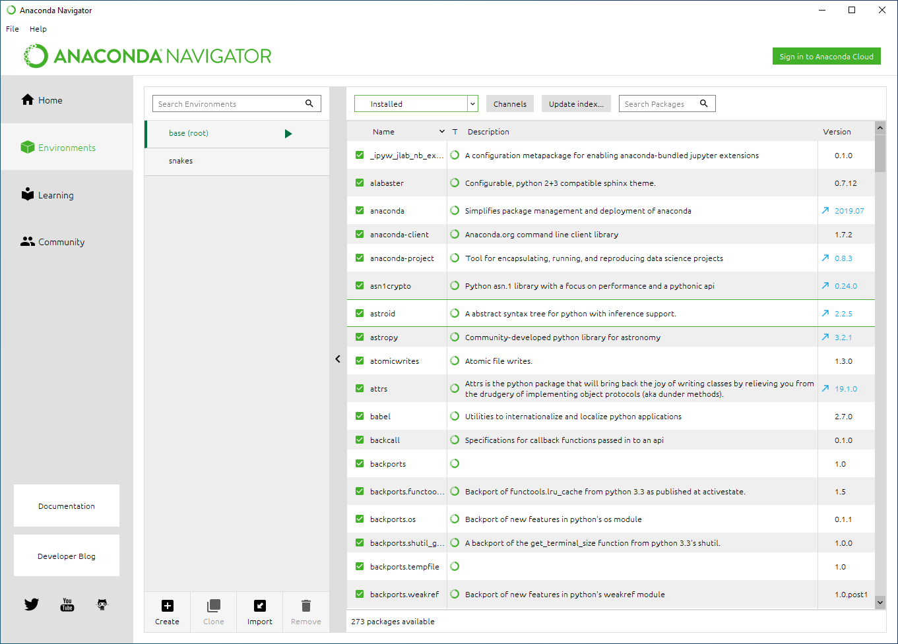
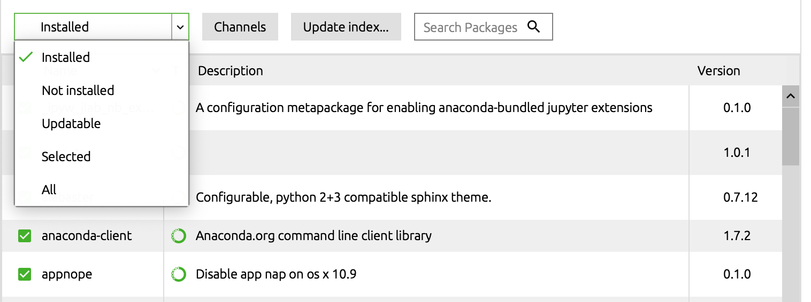

# Python-QE API

A set of tools are listed here for preparing input files for DFT calculations using Quantum Espresso. This repository(or **repo**) contains three pieces of Python scripts:

- `raw2qe.py`,a collection of functions and classes that transform CIF files into input texts.
- `qe2cif.py`, a collection of functions that reads output files from QE calculations and write atomic configurations into CIF files
- `qe2DDEC.py`, a collection of functions that reads charge density CUBE files, and analyze them using DDEC6 method to give bond order, and overlap population information of arbitrary atomic configurations.

This documentation shows a way to set up running environment for individual users.

## Install Python

Due to the variety of Windows/Mac/Linux OS distributions, the arguably easiest way to install Python is to install [Anaconda](https://www.anaconda.com/products/individual), a distribution of Python 3.7 along with some pre-installed numerical packages (e.g. [numpy](https://numpy.org/), and [scipy](https://www.scipy.org/)). The complete list of pre-installed packages in anaconda can be found [here](https://www.anaconda.com/open-source).

- For installation instruction on Windows OS, click [here](https://docs.anaconda.com/anaconda/install/windows/).
- For installation instruction on Mac OS, click [here](https://docs.anaconda.com/anaconda/install/mac-os/).

Once you installed `Anaconda`, open the `Anaconda Navigator` by finding it in your start navigation or in search bar. And the initial GUI looks like the picture shown below:

Now click the `install` button below **jupyter notebook**. Jupyter notebook provides an intuitive way to write and inteprete your Python code as we shall see later.
### Install Packages
We need to install `ASE` package (check the documentation [here](https://wiki.fysik.dtu.dk/ase/)) in your `Anaconda` distribution. To do so, click the `Environment` in the navigator shown above to get

1. If `ASE` is not installed, you can find it by navigating to the drop-down menu `Not installed` and then searching for `ASE`:

2. Select the package you want to install, and click `Apply` in the popup window. 
3. Now you can use `ASE` in your python code.

To use **jupyter notebook**, we simply open **Anaconda Navigation** and click the **jupyter** icon. Your browser will start automatically and show the following GUI:

You can start by creating a **folder** with the `New` drop-down menu:

The name of your new folder will be **Untitled folder** but you can always change its name later by right click the folder in **Jupyter**. We now open **Untitled folder** in **jupyter** to arrive at the following interface:

Create a `Python 3` notebook and open it to get

where the command window in green rectangle is the **current active window**. Let's write a simple command and run it using `shift+enter` combo:

From the picture above, we know that
- **Jupyter notebook** create new empty command window below the previously active window
- The output of the previously active window shows up right before the current active window.
## Compile Quantum Espresso
In this section we provide a way to compile Quantum Espresso on normal university-level computation platform, with and without external libraries. The file system for each individual user is run on a Linux system with an access to `home` folder.
### Without libxc
- Create a folder `dft` in your `home` folder 
- Enter new folder `cd dft`
- Download newest QE package [here](https://github.com/QEF/q-e/releases/tag/qe-6.4) to your personal computer, then upload the downloaded `tar.gz` file to `dft` folder using **FileZilla** or similar software.
- Run `tar -xvf qe-XXXX.tgz` to unzip the source files in `dft\qe-X.Y.Z` where `X`,`Y`, and `Z` are version numbers.
- Load required compiling modules by 
`module load gcc`
and
`module load intel/18.0` or `module load python/3`
- `cd qe-X.Y.Z`to get into source folder
- Configure source files by running 
`./configure -enable-openmp=yes -with-scalapack=intel`
- Compile
`make all`

## With Libxc
>**Important Note:** Some exchange-correlation functionals in [Libxc](https://www.tddft.org/programs/libxc/) is not well-tested for all classes of materials. Make sure you know what you're doing if you want to use Libxc with QE.

- Install libxc using autotool:
(1) Download `libxc` [here](https://www.tddft.org/programs/libxc/download/)
(2) Upload the `tar.gz` file to `dft` folder
(3) Unzip the file by using `tar -xvf libxc-x.y.z.tar.gz`, where `x`,`y`, and `z` are version numbers again
(3) Run the following command(no change is needed):
`./configure --prefix=PATH/TO/LIBXC`
`make`
`make check`
`make install`
- Configure QE
`cd qe-X.Y.Z/`
`module load gcc intel/18.0`
`./configure -enable-openmp=yes -with-scalapack=intel -with-libxc=yes -with-libxc-prefix=PATH/TO/LIBXC -with-libxc-include=PATH/TO/LIBXC/include`

- Change make.inc file and make
(1) open the `make.inc` file in the folder `qe-X.Y.Z` using `nano make.inc`
(2) change the `DFLAGS` line into
`	DFLAGS         =  -D__DFTI -D__LIBXC -D__MPI -D__SCALAPACK -D__SPIN_BALANCED
`
(3) save the file, and run `make all`

## Navigation of the Repo
>**Important note:** Please pay attention to the comment lines starting with **!!!** in the code. Those lines tell you how to change the code if you're using different pseudopotential or you are using it in different operating system environment.
- `pwPrep_test.ipynb` shows the examples of using `raw2qe.py` to
(1) Update options in input files
(2) Prepare input files for `pw.x`,`dos.x`, and `projwfc.x`
- `qe2DDEC.ipynb` shows the examples of using `qe2DDEC.py` to 
(1) prepare `job_control.txt` to initialize DDEC6 analysis
(2) run DDEC6 binary executable in a pythonic way
(3) extract useful infomation from the analyses, e.g. overlap population, bond orders
- `qe2cif.ipynb` shows the examples of using `qe2cif.py` to
(1) read atomic configurations from QE outputs
(2) save relaxed atomic configurations in a `cif` format
(3) adjust atoms' info using `ASE`

## Citation
Please cite our [paper](https://pubs.acs.org/doi/abs/10.1021/acs.jpcc.8b12455?casa_token=xfrdGK26yPoAAAAA:DTUMcL_IFY5QfN4QwbwBKDjPrjIRaytsUORZEgbSFpGsNX2euNxbZKN0djXgdFbOv8QqF7LFRhvX56A) if you decide to use our code for your research:

[1] Liu, Sizhe, and Kyle C. Smith. "Intercalated Cation Disorder in Prussian Blue Analogues: First-Principles and Grand Canonical Analyses." The Journal of Physical Chemistry C 123.16 (2019): 10191-10204.