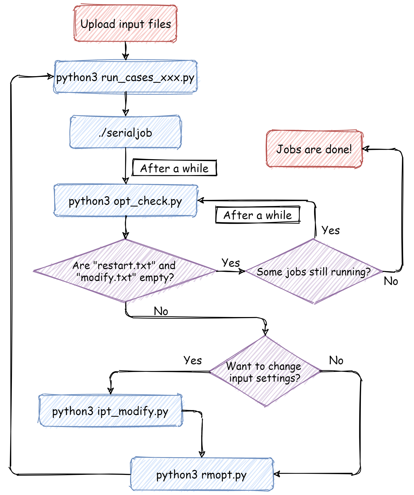

# Python-QE API
>**Update @05/01/21**: collect useful scripts in the folder `workflow_scripts` for running
batch jobs on different HPC platform.

>**Update @04/21/21**: updated `run_cases.py` for running multi-node jobs on HPC server configured with the slurm system.

>**Update @01/21/21**: updated README to clarify some aspects of running jobs on slurm system.

>**Update @12/28/20**: due to the change of system environment on campuscluster, `run_cases.py`,`run_cases_bridges2.py` and `run_cases_phonon.py` in the folder `run_cases_script` are updated for submitting jobs to SLURM batch system.

>**Update @12/22/20**: add interactive commands in `run_cases.py` to ask users if they want to change information of node number, core number per node, and walltime in `.pbs` file.

>**Update @12/15/20**: (1) edited the "singlePointCalculator" class in qe2cif.py, enabling it reading total force and cell pressure; (2) updated "run_cases.py" so that 'restart' input file can also be submitted to computing platform.

>**Update @06/22/20**: (1)fixed typos in `prep_ppipt`,`prep_dosipt`,and `prep_pdosipt`,(2)add job dependency in `run_cases.py`,(3) finished the tests on `qe2DDEC.py`.

Some useful tools are listed here for preparing and analyzing DFT calculations using Quantum Espresso. This repository(or **repo**) contains three pieces of Python scripts:

- `raw2qe.py`,a collection of functions and classes that transform CIF files into input texts.
- `qe2cif.py`, a collection of functions that reads output files from QE calculations and write atomic configurations into CIF files
- `qe2DDEC.py`, a collection of functions that reads charge density CUBE files, and analyze them using DDEC6 method to give bond order, and overlap population information of arbitrary atomic configurations.
- `run_cases.py` a script that prepare `sbatch` files for individual calculations, and enforce the dependence among different kinds of jobs using `pw.x`,`pp.x`,`bands.x`,`dos.x`, and `pdos.x`.
- `run_cases_phonon.py` a script that prepare `sbatch` files for individual calculations, and enforce the dependence among different kinds of jobs using `pw.x`,`ph.x`,`matdyn.x`,and `q2r.x`.

And three **jupyter notebooks** are inluded to show some examples of using functions in the three script files:

- `pWprep_test.ipynb` shows examples of using `raw2qe.py`

- `qe2DDEC_test.ipynb` shows examples of using `qe2DDEC.py`

- `qe2cif_test.ipynb` shows examples of using `qe2cif.py`

The sections below are arranged as
- [Install Python](#install-python)       
- [Install Packages](#install-packages)    
- [Compile Quantum Espresso](#compile-quantum-espresso)        
    - [Without libxc](#without-libxc)        
    - [With Libxc](#with-libxc)  
- [Set up file system ready for DFT calculation](#set-up-file-system-ready-for-dft-calculation)   
- [Submit Calculation jobs](#submit-calculation-jobs)        
    - [!!! The workflow for running calculations](#-the-workflow-for-running-calculations)
    - [Useful command for running jobs on a slurm system](#useful-command-for-running-jobs-on-a-slurm-system)
    - [Useful scripts for running batch jobs on a slurm system](#useful-scripts-for-running-batch-jobs-on-a-slurm-system)
- [Navigation of the Repo](#navigation-of-the-repo)
- [Citation](#citation)

## Install Python

Due to the variety of Windows/Mac/Linux OS distributions, the arguably easiest way to install Python is to install [Anaconda](https://www.anaconda.com/products/individual), a distribution of Python 3.7 along with some pre-installed numerical packages (e.g. [numpy](https://numpy.org/), and [scipy](https://www.scipy.org/)). The complete list of pre-installed packages in anaconda can be found [here](https://www.anaconda.com/open-source).

- For installation instruction on Windows OS, click [here](https://docs.anaconda.com/anaconda/install/windows/).
- For installation instruction on Mac OS, click [here](https://docs.anaconda.com/anaconda/install/mac-os/).

Once you installed `Anaconda`, open the `Anaconda Navigator` by finding it in your start navigation or in search bar. And the initial GUI looks like the picture shown below:

Now click the `install` button below **jupyter notebook**. Jupyter notebook provides an intuitive way to write and inteprete your Python code as we shall see later.

## Install Packages
We need to install `ASE` package (check the documentation [here](https://wiki.fysik.dtu.dk/ase/)) in your `Anaconda` distribution. To do so, click the `Environment` in the navigator shown above to get

1. If `ASE` is not installed, you can find it by navigating to the drop-down menu `Not installed` and then searching for `ASE`:

2. Select the package you want to install, and click `Apply` in the popup window. 
3. Now you can use `ASE` in your python code.

To use **jupyter notebook**, we simply open **Anaconda Navigation** and click the **jupyter** icon. Your browser will start automatically and show the following GUI:

You can start by creating a **folder** with the `New` drop-down menu:

The name of your new folder will be **Untitled folder** but you can always change its name later. We now open **Untitled folder** in **jupyter** to arrive at the following interface:

Create a `Python 3` notebook and open it to get

where the command window in green rectangle is the **current active window**. Let's write a simple command and run it using `shift+enter` combo:

From the picture above, we know that
- **Jupyter notebook** create new empty command window below the previously active window
- The output of the previously active window shows up right before the current active window.

## Compile Quantum Espresso
In this section we provide a way to compile Quantum Espresso on normal university-level computation platform, with and without external libraries. The file system for each individual user is run on a Linux system with an access to `home` folder.
### Without libxc
- Create a folder `dft` in your `home` folder 
- Enter new folder `cd dft`
- Download newest QE package [here](https://github.com/QEF/q-e/releases) to your personal computer, then upload the downloaded `tar.gz` file to `dft` folder using **FileZilla** or similar software.
- Run `tar -xvf qe-XXXX.tgz` to unzip the source files in `dft\qe-X.Y.Z` where `X`,`Y`, and `Z` are version numbers.
- Load required compiling modules by 
`module load gcc/7.2.0`,
`module load openmpi/4.0.5-gcc-7.2.0`, **make sure these versions of the two packages match each other!!!**
>As of April 7,2021, compiling quantum espresso using `intel` package does not evoke `fftw` package, while `lfftw` is automatically loaded when quantum espresso is compiled with `gcc`.
- `cd qe-X.Y.Z`to get into source folder
- If you're running QE on slurm system, you might want to add `MANUAL_DFLAGS  = -D__ISO_C_BINDING` in `make.inc` file to avoid `data parsing` error
- Configure source files by running 
`./configure -enable-parallel`
- Compile
`make all`

### With Libxc
>**Important Note:** Some exchange-correlation functionals in [Libxc](https://www.tddft.org/programs/libxc/) are not well-tested for all classes of materials. Make sure you know what you're doing if you want to use Libxc with QE.

- Install libxc using autotool:
(1) Download `libxc` [here](https://www.tddft.org/programs/libxc/download/)
(2) Upload the `tar.gz` file to `dft` folder
(3) Unzip the file by using `tar -xvf libxc-x.y.z.tar.gz`, where `x`,`y`, and `z` are version numbers again
(3) Run the following command(no change is needed):
`./configure --prefix=PATH/TO/LIBXC`
`make`
`make check`
`make install`
- Configure QE
`cd qe-X.Y.Z/`
`module load gcc intel/18.0`
`./configure -enable-openmp=yes -with-scalapack=intel -with-libxc=yes -with-libxc-prefix=PATH/TO/LIBXC -with-libxc-include=PATH/TO/LIBXC/include`

- Change make.inc file and make
(1) open the `make.inc` file in the folder `qe-X.Y.Z` using `nano make.inc`
(2) change the `DFLAGS` line into
`DFLAGS         =  -D__DFTI -D__LIBXC -D__MPI -D__SCALAPACK -D__SPIN_BALANCED`
(3) save the file, and run `make all`

## Set up file system ready for DFT calculation
1. create a folder at `/home/` named as `/pseudo/` to store your pseudopotential files
2. Download full-element pseudopotential package. My personal favorite is [GBRV Pseudopotential](https://www.physics.rutgers.edu/gbrv/). Other good resources are [Pseudo Dojo](http://www.pseudo-dojo.org/), and [SSSP](https://www.materialscloud.org/discover/sssp/table/efficiency) on Material cloud.
3. Before you upload your pseudopotential files onto computation platform, **it is recommended to change your commonly-used pseudopotentials' name into a format of `X.upf`**, with `X` being the element symbol. Below is what my `pseudo` folder looks like

where `rVV10_kernel_table` and `vdW_kernel_table` are generated by runing the `generate_rVV10_kernel_table.x` and `generate_vdW_kernel_table.x` in the `/PW/src` subfolder of your QE installation. **You will use them when you have strong van der Waals' interactions in your atomic system**.
4. The `outdir` option in your input file should always be `"/home/netID/scratch/"`+**unique name** to your calculation case. If your `.in` files have unique names, `raw2qe.py` sets the `outdir` to be `/home/netID/scratch/`+ your input file name automatically.
>Scratch is a **temporary storage space** that saves your output files for at most 30 days. Make sure you transfer your data after the calculations are done.
5. Create a `inputdir` folder to store all your input file. In the same folder, create shortcuts to your QE executables by using the following command(in your `inputdir` folder):

- `ln -s /path/to/qe/installation/PW/src/pw.x pw.x`
- `ln -s /path/to/qe/installation/PP/src/pp.x pp.x`
- `ln -s /path/to/qe/installation/PP/src/dos.x dos.x`
- `ln -s /path/to/qe/installation/PP/src/projwfc.x projwfc.x`
> We use symbolic links to avoid complicated path when we run DFT calculations.

## Submit Calculation jobs
The `run_cases_xxx.py` in the folder `run_cases_script` prepares `SBATCH` files for batch job submission on computation platform running on `slurm` system(e.g. campuscluster). It generates `SBATCH` files for all the `.in` files in your `inputdir` folder. It changes executable command based on the names of input files. Similarly, `run_cases_phonon.py` preparaes `SBATCH` files for phonon-related calculations using `ph.x`,`dynmat.x`, and `q2r.x`. The complete rules for running QE according to `run_cases.py` are listed below:

- If the file is named as `xxxx.in` without symbol of `_`, `run_cases.py` ask the system to run the command of 
`mpirun ./pw.x -in xxxx.in > xxxx.out`

- If `_pp` is in the name of a `.in` file, ask the system to run the command of `mpirun ./pp.x -in xxxx_pp.in > xxxx_pp.out`

- If `_dos` is in the name of a `.in` file, ask the system to run the command of `./dos.x -in xxxx_dos.in > xxxx_dos.out`

- If `_pdos` is in the name of a `.in` file, ask the system to run the command of `./projwfc.x -in xxxx_pdos.in > xxxx_pdos.out`.

A typical `sbatch` file is shown below:

where 

1. `#SBATCH N 4` and `#SBATCH n 14` set number of computation nodes and total number of CPU cores you want to use for the calculation.

> as of April 7, 2021, the slurm system running on HPC platform allows users to specify number of cpu cores only. *You might consider delete command of `#SBATCH N 4` as it might cause slot allocation errors*

2. `#SBATCH --partition=xxxx` choose your job queue (the queue can be `eng-research` or `secondary`) if you are using NCSA campuscluster at UIUC.

3. `#SBATCH --time=04:00:00` tells the system to kill your job after some time (the job will be killed after 1 hr in this case). **The maximum walltime is 4hrs**.(**If you have a large job that takes more than 4hrs to finish, try to use `restart_mode` in input file, see `pwPrep_test.ipynb`**)

4. `#SBATCH --job-name="scf-rlx"` gives a name for your job(the name is `scf-rlx` in this case).

5. `module load python/3` loads necessary package for your jobs.

6. `cd /home/yourID/inputdir` is required for the system to find your links to `pw.x`, `pp.x` etc.

### !!! The workflow for running calculations
1. Upload all your input files to `inputdir` folder
2. Make sure `run_cases_xxx.py` is also in the `inputdir` folder and load python3 module by `module load python/3`. 
>Please use `run_cases_cc.py` on NCSA campuscluster and use `run_cases_expanse.py` on expanse@XSEDE. If you don't have access to none of these HPC platform, you might consider modify `run_cases_cc.py` to fit your needs.
3. Run `run_cases_xxx.py` by `python3 run_cases.py`. This is a piece of interactive code, and it will ask you several questions before it generates `sbatch` files. The questions are shown in the picture blow.

The last question shown above is asking to which queue you want to submit your jobs to. If you're an engineering student at UIUC, you may type `beckman`, `eng-research` or `secondary`(a common queue for everybody). After these questions, the code will spite out the names of input files and sbatch files. The interaction with `run_cases_phonon.py` is slightly different. It will ask you one more question like the picture shown below. If your answer to the last question is larger than 2, the code will create job-array command to run `ph.x`-related job repeatedly. For some reason, `job-array` is at its beta version on slurm system, so some mysterious computation errors might occur.

4. Many `sbatch` files should be created now, run `./serialjob` in your command line to submit all your jobs.
5. Wait till `./serialjob` command finishes and use `squeue -u yourNetID` to check the status of your jobs. 
6. Jobs with `C` status are finished or they are running out of the walltime. Jobs with `R` are running, and jobs with `PD` status are still pending in the queue.
7. Once all your calculations are done, download your data and use the functions in `qe2DDEC.py` or `qe2cif.py` to start your analysis.

### Useful command for running jobs on a slurm system
1. `scancel JOBID` for canceling a job using its job id.
2. `squeue -u usrID` for checking your job status using your userID
3. `squeue -u usrID -p xxxxx` for checking your job status on partition `xxxxx`
4. `sbatch xxxx.sbatch` submit a job using a `sbatch` file
5. `sbatch --exclude cccc xxxxx.sbatch` submit a job by avoiding using node `cccc`

### Useful scripts for running batch jobs on a slurm system
Submitting a large number of jobs at the same time can be messy. Platform configuration errors could happen anytime, resulting mysterious termination and unfinished jobs. If you want to keep everything organized, you might want to use the scripts provided in the folder `workflow_scripts`. If you want to know more or change these scripts, you will get a better idea about them by reading the summaries at the top of these scripts. A recommended workflow for running large batch of jobs on HPC platform is shown in the flowchart below.

 
## Navigation of the Repo
>**Important note:** Please pay attention to the comment lines starting with **!!!** in the code. Those lines tell you how to change the code if you're using different pseudopotential or you are using it in different operating system environment.
- `pwPrep_test.ipynb` shows the examples of using `raw2qe.py` to

(1) Update options in input files

(2) Prepare input files for `pw.x`,`dos.x`, and `projwfc.x`

- `qe2DDEC.ipynb` shows the examples of using `qe2DDEC.py` to 

(1) prepare `job_control.txt` to initialize DDEC6 analysis

(2) run DDEC6 binary executable in a pythonic way

(3) extract useful infomation from the analyses, e.g. overlap population, bond orders

- `qe2cif.ipynb` shows the examples of using `qe2cif.py` to

(1) read atomic configurations from QE outputs

(2) save relaxed atomic configurations in a `cif` format

(3) adjust atoms' info using `ASE`

- `workflow_scripts` folder contains scripts for

(1) Preparing `SBATCH` file for each job,

(2) Creating bash script `serialjob` that submit various kinds of jobs by complying their dependency,

(3) Checking integrity of output files and categorying their names into `complete.txt`,`restart.txt`, and `modify.txt`,

(4) Modifying settings in input files, and 

(5) Removing output files listed in `restart.txt`.

## Citation
Please cite our [paper](https://pubs.acs.org/doi/abs/10.1021/acs.jpcc.8b12455?casa_token=xfrdGK26yPoAAAAA:DTUMcL_IFY5QfN4QwbwBKDjPrjIRaytsUORZEgbSFpGsNX2euNxbZKN0djXgdFbOv8QqF7LFRhvX56A) if you decide to use our code for your research:

[1] Liu, Sizhe, and Kyle C. Smith. "Intercalated Cation Disorder in Prussian Blue Analogues: First-Principles and Grand Canonical Analyses." The Journal of Physical Chemistry C 123.16 (2019): 10191-10204.

If you end up using our `qe2DDEC.py`, please cite the following papers too:

[2] T. A. Manz and N. Gabaldon Limas, “Introducing DDEC6 atomic population analysis: part 1. Charge partitioning theory and methodology,” RSC Adv., 6 (2016) 47771-47801. 

[3] N. Gabaldon Limas and T. A. Manz, “Introducing DDEC6 atomic population analysis: part 2. Computed results for a wide range of periodic and nonperiodic materials,” RSC Adv., 6 (2016) 45727-45747. 