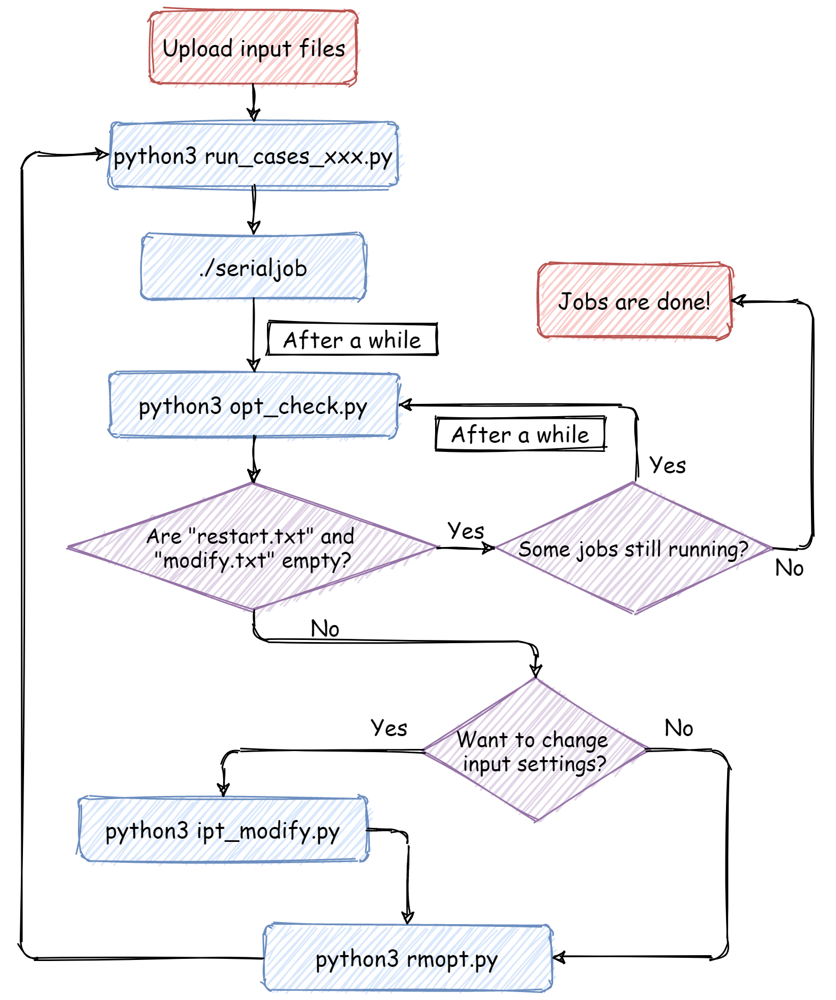

## Workflow Scripts
---
This folder contains some useful scripts for running batch jobs on high-performance computing (HPC) clusters. The scripts with names of `run_cases_xxx` generate "sbatch" files for each job on HPC platform `xxx`, and a bash script `serialjob` for submitting batch jobs that might or might not be dependent on each other. These scripts establish job dependency using randomly generated *`JOBID`*. Please check comments in these scripts for further instructions of how to modify the scripts to fit your needs. **Before you use these scripts on HPC, make sure you copy all of them into the folder where you store target input and output files.**

### `opt_check.py`
The script `opt_check.py` checks integrity of output files and generates `restart.txt`,`modify.txt`, and `complete.txt` files that list output files satisfying pre-specified conditions. **To use the script, first make sure the contents in the lists, `check` and `check2`, are indeed what you want**. Any string in `check` found in a output file results in its name recorded in `modify.txt`, and `complete.txt` keeps the names of outputs that contain all the strings in the `check2` list. `restart.txt` has all the names of output files **in `modify.txt`** plus the names **not in `complete.txt` that have their latest modification time at least `x` hours ago, where `x` is an user-defined number**.

In summary, files listed in `modify.txt` needs modifications of their input parameters. Files in `restart.txt` are ready to restart after using the same set of input settings. Notice that the list in `modify.txt` overlaps with the one in `restart.txt`, so you might consider modify input files in `modify.txt` before you restart jobs. And `complete.txt` gives you the names of finished jobs.

### `ipt_modify.py`
The script `opt_check.py` should be run after `opt_check.py`. It modifies settings of input files that have their corresponding outputs listed in `modify.txt`. User specifies which values he/she want to change by typing as many tuples as they want interactively after he/she runs the script using `python3 ipt_modify.py`. Each tuple has a format of `old value,new value`. If `old value` appears multiple times in the input file, you can specify which of them you want to change by specifying the parameter name in the tuple as `name,old value, new value`.

### `rmopt.py`
The script `rmopt.py` removes output files with their names listed in `restart.txt` or `modify.txt`. Note that running this script is **recommended** for job submission workflow. Runing `rmopt.py` before restarting the jobs guarantees that the newly generated output files belong to the newest calculations.

### A recommended workflow:
Enjoy the chart below!

